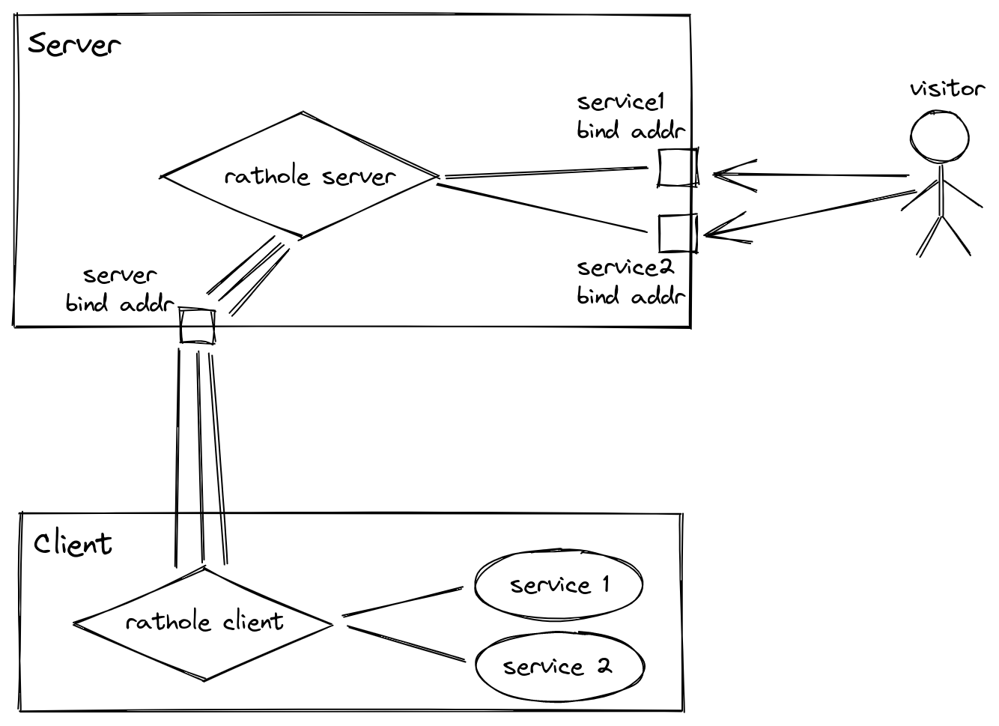

# Internals

## Conceptions
### Service
The entity whose traffic needs to be forwarded

### Server
The host that runs `rathole` in the server mode

### Client
The host behind the NAT that runs `rathole` in the client mode. It has some services that need to be forwarded.

### Visitor
Who visists a *service*, via the *server*

### Control Channel
A control channel is a TCP connection between the *server* and the *client* that only carries `rathole` control commands for one *service*.

### Data Channel

A data channel is a TCP connection between the *server* and the *client* that only carries the encapsulated data that needs forwarding for one *service*.

## The Process

*TODO: Add more details about the protocol*

When `rathole` starts in the client mode, it creates connections to `server.common.bind_addr` for each service. These connection acts as control channels.

When a control channel starts, the server challenge the client by a nonce, the client is required to authenticate as the service it wants to represent. Then the forwarding of that service is set up.

When the server accepts a connection on a service's `bind_port`, it sends a control command to the client via the corresponding contorl channel. Then the client connects to the server to create a data channel. In this way, a forwarding is set up. The server also creates a few data channels in advance to improve the latency.

